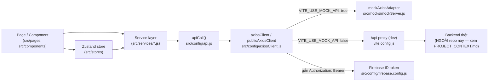

# ARCHITECTURE — Kiến trúc frontend

_Cập nhật: 2026-08-04. Mô tả kiến trúc **frontend** của repo này. Backend/database thật nằm ngoài phạm vi — xem [PROJECT_CONTEXT.md](PROJECT_CONTEXT.md)._

## Kiểu kiến trúc

SPA (Single Page Application) React + Vite, client-side routing (React Router), state toàn cục bằng Zustand, gọi REST API qua Axios với khả năng chuyển đổi giữa **mock adapter nội bộ** và **backend thật** bằng 1 biến môi trường (`VITE_USE_MOCK_API`). Không có server-side rendering.

## Các module chính và trách nhiệm

| Module | Trách nhiệm |
|---|---|
| `src/pages/*` | Trang theo route, tổ chức theo vai trò (`admin/`, `manager/`, `storeManager/`, `staff/`, `customer/`, `auth/`). Chứa logic UI + gọi service/store. |
| `src/layouts/*` | Khung trang dùng chung: `CustomerLayout` (header/footer site khách hàng), `DashboardLayout` (sidebar theo vai trò cho nội bộ, dùng chung cho ADMIN/MANAGER/STORE_MANAGER/STAFF qua prop `role`). |
| `src/routes/ProtectedRoute.jsx` | Bảo vệ route theo vai trò, redirect về đúng trang login/dashboard nếu chưa đăng nhập hoặc sai vai trò. |
| `src/navigations/*` | Khai báo menu sidebar (icon, label, href, children) theo từng vai trò, đọc bởi `DashboardLayout` qua `NAV_CONFIG`. |
| `src/components/*` | UI dùng chung: `ui/` (Table, PaginationControls, SearchInput...), `modal/` (30+ modal CRUD), `form/`, `dashboard/`, `customer/`, `order/`. |
| `src/stores/*` | State toàn cục (Zustand): `authStore`, `cartStore`, `orderStore`, `shiftStore`, `userStore`, `useFranchiseStore`, `useLanguageStore`, `useLoyaltyStore`, `useProductStore`, `useRecommendationStore`, `useSearchStore`. |
| `src/services/*` | Lớp gọi API theo domain nghiệp vụ (auth, user, product, category, order, inventory, promotion, franchise, customer, shift — qua `shiftApi` trong `api.js`, payment, delivery, AI, report, cloudinary). Là ranh giới duy nhất được phép gọi `apiCall`/`axiosClient`. |
| `src/config/api.js` | Định nghĩa `ENDPOINTS` (map path REST) + hàm `apiCall()` dùng chung + một số API object cấp cao (`orderApi`, `shiftApi`, `deliveryApi`, `cartApi`, `productApi`, `categoryApi`, `aiApi`, `reportApi`, `storeRequestApi`). |
| `src/config/axiosClient.js` | Tạo 2 axios instance (`axiosClient` cho request cần auth, `publicAxiosClient` cho public), interceptor gắn Firebase token, tự refresh token khi 401, tự chuyển sang mock adapter khi `USE_MOCK_API=true`. |
| `src/config/firebase.config.js` | Khởi tạo Firebase App/Auth — dùng config mock cố định khi bật mock, dùng biến `VITE_FIREBASE_*` khi tắt mock. |
| `src/mocks/*` | `mockConfig.js` (cờ bật/tắt), `mockServer.js` (dữ liệu giả + axios mock adapter, đóng vai trò "backend giả" đầy đủ cho mọi endpoint trong `api.js`). |
| `src/constraints/index.js` | Hằng số dùng toàn app: `ROLES`, `ROLE_ROUTES`, `ORDER_STATUS`, `SHIFT_STATUS`, `HTTP_METHODS`, danh mục sản phẩm mẫu... |
| `src/locales/*` | Bộ dịch vi/en/jp, `useLanguageStore` quyết định ngôn ngữ hiện tại. |
| `src/utils/*` | `errorHandler.js`, `helpers.js`, `mockData.js` (dữ liệu mẫu bổ sung ngoài `mocks/`). |

## Luồng dữ liệu: UI → service → API → (mock hoặc backend thật)

Quy tắc bắt buộc: **component không được gọi `apiCall`/`axiosClient` trực tiếp** — luôn đi qua 1 hàm trong `src/services/`. Vi phạm quy tắc này là điểm cần sửa khi review code.

## Ranh giới frontend / backend / shared

- Repo này = 100% frontend. Không có `backend/`, `shared/` — nếu cần chia sẻ type/constant với backend thật trong tương lai, phải có ADR mới (xem DECISIONS.md ADR-001).
- `src/config/api.js` là **ranh giới hợp đồng**: mọi thay đổi ở đây tương đương thay đổi giả định về backend thật, phải đối chiếu với đội backend trước khi merge, không tự suy đoán.

## Dependency được phép / bị cấm

- **Được phép**: `pages` → `components`, `stores`, `services`, `locales`, `constraints`, `utils`. `services` → `config`, `constraints`. `components` → `stores`, `services`, `constraints`, `locales` (không phụ thuộc ngược lại `pages`).
- **Bị cấm**: `components/`, `stores/`, `services/` import ngược từ `pages/`. `services/` không được import trực tiếp React component. Không gọi `fetch`/`axios` trực tiếp ngoài `src/config/axiosClient.js` và `src/config/api.js`.

## Xử lý lỗi

- Tầng `apiCall()` (`src/config/api.js`) chuẩn hoá lỗi: lấy `error.response?.data?.message` hoặc `error.message`, gán lại vào `error.message`, log console rồi `throw` tiếp cho service/component xử lý (thường hiển thị qua `react-hot-toast`).
- `axiosClient` interceptor xử lý riêng lỗi 401: thử lấy Firebase ID token mới và retry request 1 lần; nếu thất bại thì logout + điều hướng về đúng trang login theo path hiện tại (`/admin/*` → `/admin/login`, còn lại → `/login`).
- Chi tiết đầy đủ: [docs/backend/ERROR_HANDLING.md](backend/ERROR_HANDLING.md).

## Authentication & Authorization

- **Authentication**: Firebase Authentication (ID token), đồng bộ với backend qua `POST /auth/sync-user` (xem `src/services/authService.js`). Khi bật mock, dùng token giả `mock-token:user-customer-01` hoặc token lưu trong `authStore`.
- **Authorization**: phân quyền theo vai trò (không phải permission chi tiết ở tầng route) — `ProtectedRoute` so khớp `role` yêu cầu của route với `user.role` lấy từ `authStore`. Chi tiết: [docs/backend/AUTHORIZATION.md](backend/AUTHORIZATION.md).

## Logging & monitoring

Chỉ có `console.log`/`console.error`/`console.warn` rải rác (nhiều nhất trong `src/config/api.js`, `App.jsx`) — **chưa có** structured logging hay error tracking (Sentry...) tích hợp. Không log giá trị nhạy cảm (token, mật khẩu) — xem [SECURITY.md](SECURITY.md).

## Cache, queue, background job

Không có. `@stomp/stompjs`/`sockjs-client` có trong dependency (gợi ý realtime qua WebSocket/STOMP) nhưng **chưa xác nhận** được dùng ở đâu trong `src/` hiện tại — cần rà soát trước khi coi đây là kiến trúc đang hoạt động.
